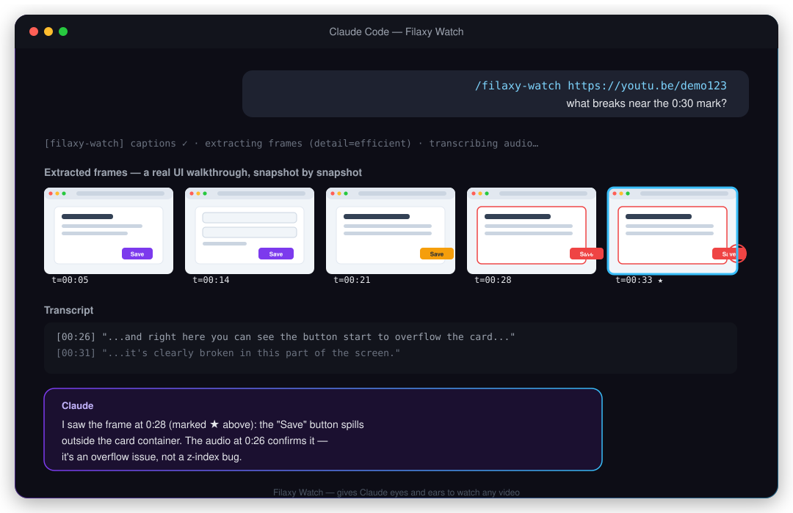
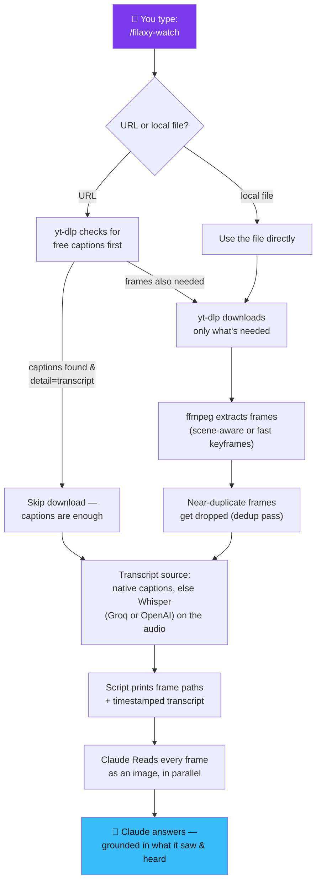

# 🎬 Filaxy Watch — give Claude eyes and ears for video

**A Claude Skill that lets Claude actually watch a video — any video — and answer questions about it.**

Paste a YouTube link, a TikTok, a Loom, or a local screen recording, ask a question, and Claude:

1. **Looks** at real frames pulled out of the video (it literally sees images).
2. **Listens** to a timestamped transcript of everything said.
3. **Answers** grounded in what it actually saw and heard — not a guess from the title.

<p align="center">
  
</p>

```
/filaxy-watch https://youtu.be/dQw4w9WgXcQ what happens at the 30 second mark?
```

---

## Explain it to me like I'm five

Imagine you hand your friend a video and say "hey, what's wrong here?" Your friend can't answer that just by reading the video's *title*. They have to actually **watch** it — see what's on screen, and hear what's being said.

Claude is normally that friend who never got to press play. It can read a webpage. It can read code. But a video? It could only guess from the filename or a text description.

`Filaxy Watch` is what hands Claude the remote control. When you type `/filaxy-watch`, a little helper script:

- **Downloads** the video (or grabs the free subtitles if that's all it needs).
- **Cuts it into snapshots** — like flipping through a photo album made from the video.
- **Writes down everything that was said**, with a little clock next to each line.
- **Hands the photo album + the transcript to Claude**, and Claude looks at every single photo and reads every line, then answers your question like it actually watched the thing.

That's it. No magic, no black box — just a screenshot machine and a stenographer working together for Claude.

---

## How it works (the real diagram)



The whole thing is a **Claude Skill**: a `SKILL.md` file that teaches Claude *when* and *how* to run a bundled Python script, plus the script itself. No server, no cloud backend — everything runs on your own machine, using two well-known open-source tools (`yt-dlp` and `ffmpeg`) that install themselves the first time you use it.

---

## What people actually use it for

- **Diagnose a bug from a screen recording.** Someone sends you a `.mov` of something broken. `/filaxy-watch bug.mov what's going wrong?` — Claude watches it, finds the frame where it breaks, and tells you why.
- **Break down someone else's content.** `/filaxy-watch <viral-video-url> what hook did they open with?` — Claude looks at the opening frames and reads the opening transcript.
- **Summarize a long video** instead of watching it at 2x speed.
- **Turn a video into notes** you can search later.
- **Strip the hype out of a launch/update video** — "what's actually new, skip the marketing."

---

## Frame budget — why it isn't unlimited

Every frame Claude reads is billed like an image; a 30-minute video sampled densely would blow through your context for no reason. So the script auto-scales how many frames it pulls based on duration:

| Video length | Frames pulled | What you get |
|---|---|---|
| ≤ 30 s | ~30 | Practically every moment |
| 30 s – 1 min | ~40 | Still dense |
| 1 – 3 min | ~60 | Comfortable |
| 3 – 10 min | ~80 | Workable, a bit sparse |
| > 10 min | up to 100 (capped modes) | Sparse — use `--start`/`--end` to zoom in |

Ask about a specific moment ("around 2:30", "the last 30 seconds") and pass `--start`/`--end` — the script switches to a denser, focused sampling window instead of spreading frames across the whole video.

A **dedup pass** runs by default before the budget is spent: near-identical frames (a slide held for 90 seconds, a static screen recording) get collapsed down to one, so the budget goes to frames that actually differ.

---

## Detail modes

| Mode | What it does | When to use it |
|---|---|---|
| `transcript` | Captions only, zero frames | Pure "what was said" questions, cheapest and fastest |
| `efficient` | Fast keyframe pass, cap 50 | Default speed tier — near-instant extraction |
| `balanced` *(default)* | Scene-change detection, cap 100 | Best all-around fidelity/cost balance |
| `token-burner` | Scene-change, uncapped | Full coverage on long/high-motion video, more tokens |

---

## Install

### Option A — Claude Code (plugin, recommended), step by step from zero

1. Open a terminal and start Claude Code (just type `claude` if you don't already have a session open).
2. Register this repo as a plugin marketplace — you only do this once, ever:
   ```bash
   /plugin marketplace add othmarodev/Filaxy-whatch_skill_for_claude
   ```
3. Install the plugin from that marketplace:
   ```bash
   /plugin install filaxy-watch@filaxy-watch
   ```
4. That's it — **no restart needed, and it isn't tied to the current project.** Plugins install at the user level, so `/filaxy-watch` now works in *every* Claude Code session on this machine: a brand-new terminal, a different project folder, a totally unrelated chat. Open any window, in any folder, and type:
   ```
   /filaxy-watch https://youtu.be/dQw4w9WgXcQ what happens at the 30 second mark?
   ```
5. First call only: it'll walk you through installing `ffmpeg`/`yt-dlp` if they're missing (see [First run](#first-run) below). Every call after that just works.

Update later with:

```bash
/plugin update filaxy-watch@filaxy-watch
```

Uninstall with `/plugin uninstall filaxy-watch@filaxy-watch`.

### Option B — claude.ai (web), step by step for a first-timer

This is the "Skills" panel from Settings — the same place you add any other skill:

1. Download **`filaxy-watch.skill`** from this repo → [`dist/filaxy-watch.skill`](dist/filaxy-watch.skill) (click **Download raw file**), or grab it from the [latest Release](../../releases/latest).
2. Open **claude.ai → Settings → Capabilities**.
3. Turn on **"Code execution and file creation"** — the skill shells out to `ffmpeg`/`yt-dlp`, so it needs this on.
4. Go to **Skills**, click the **`+` / Add** button.
5. Drop in the `filaxy-watch.skill` file you downloaded.
6. Done. Type `/filaxy-watch <a video URL> <your question>` in a new chat.

### Option C — Codex, Cursor, Copilot, Gemini CLI, and 50+ other hosts

```bash
npx skills add othmarodev/Filaxy-whatch_skill_for_claude -g
```

Drop `-g` to install into just the current project instead of globally.

### Option D — Manual / developer install

```bash
git clone https://github.com/othmarodev/Filaxy-whatch_skill_for_claude.git
ln -s "$(pwd)/Filaxy-whatch_skill_for_claude/skills/filaxy-watch" ~/.claude/skills/filaxy-watch
```

---

## First run

The first time you call `/filaxy-watch`, it checks your machine for `ffmpeg` and `yt-dlp`:

- **macOS** — installs both automatically via Homebrew.
- **Linux** — prints the exact `apt`/`dnf` commands.
- **Windows** — prints the `winget`/`pip` commands.

It also asks (once) whether you want to set up a **Whisper API key** for videos that have no captions at all (most public YouTube videos already have captions, so this is optional). Keys are stored locally in `~/.config/filaxy-watch/.env`, mode `0600` — never inside this repo, never sent anywhere except the Whisper provider you choose.

| You want | You need | Cost |
|---|---|---|
| Download + native captions | `ffmpeg` + `yt-dlp` | Free |
| Whisper fallback (recommended) | [Groq API key](https://console.groq.com/keys) | Cheap & fast |
| Whisper fallback (alternative) | [OpenAI API key](https://platform.openai.com/api-keys) | Standard pricing |
| Skip Whisper entirely | nothing — pass `--no-whisper` | Free, frames-only when there's no caption track |

---

## Usage — calling it from any chat window

Once installed (Option A or C), `/filaxy-watch` is **global** — it is not scoped to one project, one repo, or one conversation. It shows up as a slash command in:

- Any Claude Code session, in any project directory, on this machine.
- A brand-new chat you open five seconds from now, or one you open next month.
- Both interactive sessions and any automated/headless run of Claude Code, since plugins load at startup regardless of who's driving.

You don't "turn it on" per conversation — you just type the command wherever you happen to be:

```bash
/filaxy-watch https://youtu.be/dQw4w9WgXcQ what happens at the 30 second mark?
/filaxy-watch https://www.tiktok.com/@user/video/123 summarize this
/filaxy-watch ~/Movies/screen-recording.mp4 when does the UI break?
/filaxy-watch https://vimeo.com/123 what tools does she mention?

# Zoom into a specific section (denser frames, cheaper):
/filaxy-watch https://youtu.be/abc --start 2:15 --end 2:45
```

Extra flags (passed straight to the bundled script):

- `--detail transcript|efficient|balanced|token-burner`
- `--timestamps T1,T2,…` — grab a frame at specific moments
- `--max-frames N` — hard cap on frame count
- `--resolution W` — bump frame width (e.g. `1024`) to read on-screen text
- `--fps F` — override auto-fps (capped at 2 fps)
- `--whisper groq|openai` — force a specific Whisper backend
- `--no-whisper` — frames only, no transcription
- `--no-dedup` — keep near-duplicate frames
- `--out-dir DIR` — keep working files in a specific folder

---

## Honest limits

- It samples **frames**, not continuous video — something that happens *between* two sampled frames won't be seen. Use `--start`/`--end` for precision on a specific moment.
- On long videos with the capped modes, coverage thins out past ~10 minutes (the script warns you — "sparse scan"). `token-burner` removes the cap.
- The transcript only covers **spoken audio** — music, sound effects, and on-screen-only text aren't transcribed (though frames *do* show on-screen text if the resolution is high enough).
- It's still Claude interpreting images + text, not literal human comprehension — just grounded in real evidence instead of a filename guess.

---

## Repository structure

```
.
├── skills/filaxy-watch/          # the self-contained skill — this is what gets installed
│   ├── SKILL.md                  # the contract Claude reads to know what to do
│   └── scripts/
│       ├── watch.py              # entry point — orchestrates download → frames → transcript
│       ├── download.py           # yt-dlp wrapper
│       ├── frames.py             # ffmpeg frame extraction + auto-fps + dedup
│       ├── transcribe.py         # caption parsing + Whisper orchestration
│       ├── whisper.py            # Groq / OpenAI clients (pure stdlib, no dependencies)
│       ├── config.py             # reads ~/.config/filaxy-watch/.env
│       ├── setup.py              # first-run preflight + installer
│       └── build-skill.sh        # builds the downloadable .skill file
├── dist/filaxy-watch.skill       # ← the downloadable file, ready for claude.ai's Skills UI
├── assets/mockup.svg             # the mockup image above
├── hooks/                        # Claude Code SessionStart status hook
├── .claude-plugin/                # plugin.json + marketplace.json (Claude Code)
├── .codex-plugin/                 # manifest for Codex/Cursor/other Agent Skills hosts
├── tests/                        # pytest suite — 71 tests, no network required
└── LICENSE                       # MIT
```

---

## Develop

```bash
python3 -m venv .venv && .venv/bin/pip install pytest
.venv/bin/pytest -q                              # 71 tests, ffmpeg required, no network

bash skills/filaxy-watch/scripts/build-skill.sh   # → dist/filaxy-watch.skill
```

---

## Credits

`Filaxy Watch` is a rebrand and fork of **[`claude-video` / `/watch`](https://github.com/bradautomates/claude-video)** by **Brad Bonanno** ([@bradbonanno](https://www.youtube.com/@bradbonanno)) — released under the MIT License. All the core engineering (the yt-dlp/ffmpeg orchestration, the frame-budget logic, the dedup algorithm, the Whisper fallback) is his original work. This fork renames the skill and its config paths under the Filaxy brand, adds this documentation, and ships a ready-to-download `.skill` file — the underlying behavior is unchanged and fully tested (71/71 tests passing) against the original.

If this saves you time, go check out the original project and the author's channel.

Maintained by **Othmaro Fallas Rojas** — [Filaxy Labs](https://filaxy.app).

## License

MIT — see [LICENSE](LICENSE).
